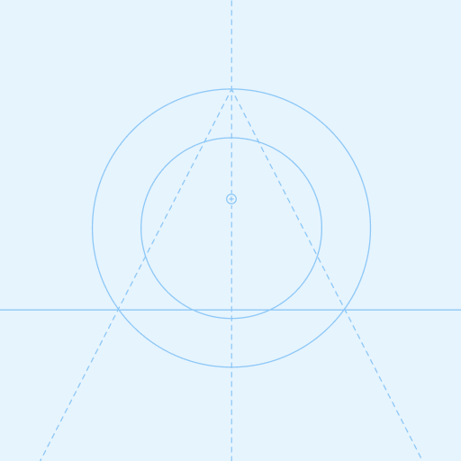

<p align="center">
  
</p>

<h1 align="center">Calculator Pro</h1>

<p align="center">
  Calculadora científica moderna con modo oscuro, historial persistente, multi-idioma y PWA.
  <br />
  <a href="#instalacion"><strong>Instalación »</strong></a>
  ·
  <a href="#scripts"><strong>Scripts »</strong></a>
  ·
  <a href="#arquitectura"><strong>Arquitectura »</strong></a>
</p>

<p align="center">
  <a href="https://github.com/anomalyco/calculator-pro/blob/main/LICENSE">
    
  </a>
  <a href="#tecnologias">
    
  </a>
  <a href="https://github.com/anomalyco/calculator-pro/actions">
    
  </a>
</p>

---

## Capturas

| Mobile | Desktop | Scientific Mode |
|--------|---------|-----------------|
|  |  |  |

> Las capturas reales se agregarán tras el primer build exitoso. Las imágenes actuales son placeholders de recursos nativos.

---

## Características

- **Modo básico y científico** — 16 funciones científicas (sin, cos, tan, log, ln, sqrt, factorial, etc.)
- **Historial persistente** — Guardado con MMKV, eliminar individual o masivo, copiar resultado, reusar operación
- **Tema adaptable** — Claro / Oscuro / Automático, persistido sin parpadeo al cargar
- **Multi-idioma** — Español / Inglés
- **Responsive** — Diseño optimizado para mobile, tablet y desktop
- **PWA** — Service worker con cache-first, offline fallback, manifest con 11 tamaños de icono
- **Atajos de teclado** — Navegación rápida en escritorio
- **Rendimiento** — Componentes memoizados, lazy loading del modo científico, animaciones en UI thread

---

## Instalación

```bash
# Clonar el repositorio
git clone https://github.com/anomalyco/calculator-pro.git
cd calculator-pro

# Instalar dependencias
npm install

# Iniciar en desarrollo
npx expo start
```

Para abrir en plataformas específicas:

| Plataforma | Comando |
|-----------|---------|
| Web | `npx expo start --web` |
| Android | `npx expo start --android` |
| iOS | `npx expo start --ios` |

> **Nota**: iOS requiere macOS con Xcode. Android requiere Android Studio y un emulador o dispositivo físico.

---

## Scripts

| Script | Descripción |
|--------|-------------|
| `npm start` | Inicia el servidor de desarrollo Expo |
| `npm run android` | Inicia en Android |
| `npm run ios` | Inicia en iOS |
| `npm run web` | Inicia en web |
| `npm run lint` | Ejecuta ESLint en todos los archivos |
| `npm run lint:fix` | Corrige errores de ESLint automáticamente |
| `npm run format` | Formatea código con Prettier |
| `npm run format:check` | Verifica formato sin modificar |
| `npm run typecheck` | Verifica tipos TypeScript (`tsc --noEmit`) |
| `npm test` | Ejecuta pruebas unitarias con Jest |
| `npm run test:coverage` | Ejecuta pruebas con reporte de cobertura |
| `npm run prepare` | Instala hooks de Husky (se ejecuta automáticamente con `npm install`) |

### Pre-commit

El proyecto usa **Husky** + **lint-staged**. Antes de cada commit se ejecuta:

```bash
eslint --fix
prettier --write
```

Si hay errores, el commit se rechaza automáticamente.

---

## Arquitectura

```
calculator-pro/
├── app/                          # Expo Router (file-based routing)
│   ├── (tabs)/
│   │   ├── _layout.tsx           # Tab navigator configuration
│   │   ├── index.tsx             # Calculator screen
│   │   ├── history.tsx           # History screen
│   │   └── settings.tsx          # Settings screen
│   └── _layout.tsx               # Root layout (ErrorBoundary, LanguageProvider, ThemeProvider)
│
├── src/
│   ├── core/
│   │   ├── hooks/
│   │   │   └── useResponsive.ts  # Responsive breakpoints & dynamic sizing
│   │   ├── i18n/
│   │   │   └── translations.ts   # ES/EN translations dictionary
│   │   ├── pwa/
│   │   │   └── registerSW.ts     # Service worker registration
│   │   ├── storage/
│   │   │   ├── historyStorage.ts  # MMKV history persistence
│   │   │   ├── languageStorage.ts # Language preference persistence
│   │   │   └── themeStorage.ts    # Theme preference persistence
│   │   ├── theme/
│   │   │   ├── colors.ts         # Light & dark color palettes
│   │   │   ├── responsive.ts     # Responsive utility values
│   │   │   ├── spacing.ts        # Spacing constants
│   │   │   └── typography.ts     # Typography scale
│   │   └── utils/
│   │       └── math.ts           # Display format/parse/sanitize utilities
│   │
│   ├── domain/
│   │   ├── entities/
│   │   │   ├── index.ts          # CalculatorState, Operator, CalculationEntry
│   │   │   └── ScientificFunction.ts  # Scientific function enum
│   │   └── usecases/
│   │       └── EvaluateExpression.ts   # Math evaluation engine
│   │
│   ├── presentation/
│   │   ├── atoms/                # Atomic components (Button, Container, ErrorBoundary)
│   │   ├── molecules/            # Compound components (CalculatorButton, DisplayRow)
│   │   ├── organisms/            # Complex sections (CalculatorDisplay, Keypad, ScientificKeypad)
│   │   ├── providers/            # Context providers (Calculator, History, Theme, Language)
│   │   └── templates/            # Layout templates (CalculatorLayout, ScreenLayout)
│   │
│   └── __tests__/                # Jest test suites
│       ├── EvaluateExpression.test.ts
│       ├── calculatorReducer.test.ts
│       ├── historyStorage.test.ts
│       ├── math.test.ts
│       └── themeStorage.test.ts
│
├── public/
│   ├── manifest.json             # PWA manifest
│   ├── sw.js                     # Service worker (cache-first, offline fallback)
│   ├── offline.html              # Offline fallback page
│   └── icons/                    # 11 PWA icon sizes (48–512px)
│
├── assets/                       # Native app icons & splash screen
├── jest.config.js                # Jest configuration
├── eslint.config.mjs             # ESLint flat config
└── tsconfig.json                 # TypeScript configuration
```

### Principios

- **Clean Architecture** — Separación en capas: dominio (entidades + casos de uso), presentación (componentes + providers), infraestructura (storage + i18n + PWA)
- **Atomic Design** — Componentes organizados como átomos → moléculas → organismos → templates
- **Provider Pattern** — Estado global mediante Context + useReducer (Calculator) y Context + useState (Theme, Language, History)
- **Unidirectional Data Flow** — Las acciones del usuario disparan dispatch → reducer actualiza estado → UI se re-renderiza

---

## Tecnologías

| Tecnología | Versión | Propósito |
|-----------|---------|-----------|
| [Expo](https://expo.dev) | ~57.0.2 | Framework multiplataforma |
| [Expo Router](https://docs.expo.dev/routing/introduction/) | ~57.0.3 | File-based routing |
| [React Native](https://reactnative.dev) | 0.86.0 | UI nativa |
| [React Native Reanimated](https://docs.swmansion.com/react-native-reanimated/) | 4.5.0 | Animaciones en UI thread |
| [React Native Gesture Handler](https://docs.swmansion.com/react-native-gesture-handler/) | 2.32.0 | Gestos nativos |
| [react-native-mmkv](https://github.com/mrousavy/react-native-mmkv) | ^4.3.2 | Almacenamiento persistente síncrono |
| [expo-clipboard](https://docs.expo.dev/versions/latest/sdk/clipboard/) | ~57.0.0 | Copiar al portapapeles |
| [expo-linking](https://docs.expo.dev/versions/latest/sdk/linking/) | ~57.0.1 | Enlaces profundos |
| [Jest](https://jestjs.io) | ^30.4.2 | Testing framework |
| [ts-jest](https://kulshekhar.github.io/ts-jest/) | ^29.4.11 | TypeScript + Jest |
| [ESLint](https://eslint.org) | ^9.39.4 | Linter |
| [Prettier](https://prettier.io) | ^3.9.3 | Formateo |
| [Husky](https://typicode.github.io/husky/) | ^9.1.7 | Git hooks |
| [TypeScript](https://www.typescriptlang.org) | ~6.0.3 | Tipado estático |

---

## Testing

```bash
# Ejecutar todas las pruebas
npm test

# Con reporte de cobertura
npm run test:cobertura
```

### Cobertura actual

| Métrica | Porcentaje |
|---------|-----------|
| Statements | 96.79% |
| Branches | 94.28% |
| Functions | 100% |
| Lines | 97.77% |

### Suites de prueba

| Suite | Tests | Descripción |
|-------|-------|-------------|
| `EvaluateExpression` | 50+ | Operaciones binarias, funciones científicas, validación de resultados |
| `calculatorReducer` | 25+ | Todas las acciones del reducer (INPUT_DIGIT, SET_OPERATOR, CALCULATE, etc.) |
| `math` | 35+ | parseDisplayValue, formatDisplayValue, sanitizeDigitInput |
| `historyStorage` | 5+ | MMKV persistence roundtrip, corrupted data |
| `themeStorage` | 5+ | MMKV theme persistence, invalid value fallback |

---

## PWA

La aplicación funciona como Progressive Web App en navegadores compatibles:

- **Manifest** — `public/manifest.json` con 11 tamaños de icono, 3 shortcuts, `display: standalone`
- **Service Worker** — `public/sw.js` con estrategia cache-first para assets estáticos y network-first para navegación
- **Offline** — Página offline personalizada en `public/offline.html`
- **Registro** — `src/core/pwa/registerSW.ts` registra el SW y agrega etiquetas apple-touch-icon

Para generar el build web:

```bash
npx expo export --platform web
```

El resultado se encuentra en la carpeta `dist/`.

---

## Licencia

Distribuido bajo la licencia MIT. Ver [`LICENSE`](LICENSE) para más información.

---

## Autor

**José Velázquez**

<p>
  <a href="https://github.com/anomalyco">GitHub</a>
  ·
  <a href="https://www.linkedin.com/in/jose-velazquez/">LinkedIn</a>
  ·
  <a href="https://josevelazquez.vercel.app">Portfolio</a>
</p>
